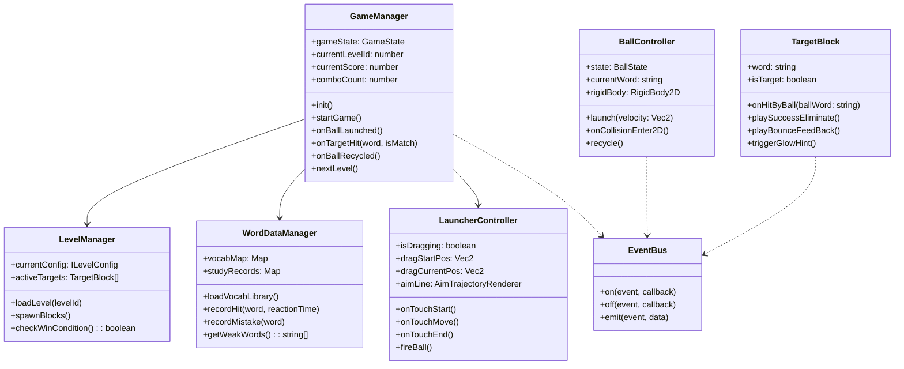

# 《弹弹识字》V1 研发规格与详细设计说明书
> 技术栈：Cocos Creator 3.8+ (2D) / TypeScript  
> 目标人群：4～6岁儿童（以《小羊上山》第2册汉字为字库核心）  
> 屏幕分辨率基准：横屏 1280 × 720 (Fit Height / Fit Width 自适应)

---

# 一、UI 页面稿与节点层级规范

## 1.1 屏幕分辨率与安全适配
- **设计分辨率**：`1280 × 720`（横屏设计）
- **适配方案**：Cocos Creator `Canvas` 设置 `Fit Width = true`, `Fit Height = true`。
- **安全区原则**：针对刘海屏/打孔屏，关键交互UI（返回、暂停、发射区）使用 `Widget` 组件，左右安全边距各预留 `40px`。

---

## 1.2 视觉与触控规范（儿童人机工程学）
1. **对比度与字号**：
   - 弹珠内汉字：字号 `44px`，无衬线粗圆体（如 `SourceHanSansCN-Heavy` 或 `YouYuan`），与弹珠背景对比度 > 7:1。
   - 目标方块内汉字：字号 `52px`，大字居中，方块尺寸 `96px × 96px`。
2. **触控容错扩大**：
   - 弹珠实际物理碰撞体半径为 `35px`（直径 `70px`）。
   - 触控判定区域（Touch Node）挂载空节点，碰撞范围设为 `120px × 120px`，确保4岁儿童手指粗略点击也能精确响应。
3. **色彩体系（玩具风马卡龙）**：
   - 场景背景：温暖鹅黄奶白 `#FFF9E6`
   - 玩家弹珠：活力橙黄 `#FFA000` / 奶白包边 `#FFFFFF`
   - 目标汉字块：马卡龙冰蓝 `#4FC3F7`、草绿 `#81C784`、樱粉 `#F06292`
   - 普通反弹块：橡胶木色 `#D7CCC8` / 弹性缓冲胶垫 `#FFCA28`

---

## 1.3 核心页面线框稿与节点树

### 1.3.1 主界面 (Start Scene)
```text
+-----------------------------------------------------------------------+
|  [🔊 音乐开关]                                          [👨‍👩‍👦 家长中心]  |
|                                                                       |
|                          ★ 弹 弹 识 字 ★                              |
|                         (卡通弹珠跳动动效)                            |
|                                                                       |
|                             ┌────────┐                                |
|                             │ ▶ 开始 │                                |
|                             └────────┘                                |
|                                                                       |
|         ☁ (浮动云朵装饰)                     ☁ (浮动云朵装饰)         |
+-----------------------------------------------------------------------+
```

**主界面节点树：**
```text
Canvas (Canvas, Widget)
├── Camera2D
├── Background (Sprite: bg_gradient, Widget 撑满)
├── DecorLayer (浮动云朵、星星粒子装饰)
│   ├── CloudLeft (Sprite, Tween 缓动)
│   └── CloudRight (Sprite, Tween 缓动)
├── TopBar
│   ├── AudioToggle (Button, Sprite, Widget Top-Left: 30, 30)
│   └── ParentGateBtn (Button, Sprite, Widget Top-Right: 30, 30)
├── LogoContainer (UITransform, 居中跳动缓动)
│   ├── LogoSpine/LogoSprite (弹弹识字美术字)
│   └── SloganLabel (Label: "边弹边认，越弹越聪明", fontSize: 24)
└── PlayBtn (Button, Sprite: 巨大果冻按钮 240x80, Y: -120)
    └── BtnLabel (Label: "开 始", fontSize: 40, color: #FFFFFF)
```

---

### 1.3.2 战斗主界面 (GamePlay Scene)
分为三大功能区：
1. **TopHUD (顶部监控区，高 90px)**：显示关卡进度、已集星星、连击 Combo、暂停按钮。
2. **PlayField (物理核心区，高 450px)**：目标字块、反弹障碍、弹珠高速飞行动画、消除粒子。
3. **LaunchArea (发射操作区，高 180px)**：弹弓发射座、待发弹珠、瞄准虚线导向、下一颗字提示。

```text
+-----------------------------------------------------------------------+
| [⏸] 第 1 关           ⭐⭐⭐ 连击 x2!           得分: 0120           |
+-----------------------------------------------------------------------+
|  [墙]                                                           [墙]  |
|                                                                       |
|       ┌─────┐                  ┌─────┐                                |
|       │ 日  │                  │ 月  │                                |
|       └─────┘                  └─────┘                                |
|                     ┌─────┐                                           |
|                     │ 弹框 │                                          |
|                     └─────┘                                           |
|                                                                       |
|                            ┌─────┐                                    |
|                            │ 山  │                                    |
|                            └─────┘                                    |
|                                                                       |
+ - - - - - - - - - - - - - - - - - - - - - - - - - - - - - - - - - - - +
|  下一颗:                                                              |
|   (月)             ○ 预测轨迹点                                       |
|                   /                                                   |
|                 ╭───╮  <-- 拖动弹珠向下拉射                           |
|                 │山 │                                                 |
|                 ╰───╯                                                 |
+-----------------------------------------------------------------------+
```

**战斗场景节点树：**
```text
Canvas (Canvas, UITransform: 1280x720)
├── MainCamera (Camera2D)
├── EnvironmentLayer
│   ├── BgSprite (Sprite, 游戏主背景)
│   └── BoundWalls (Node: 四周静态边界)
│       ├── TopWall (StaticRigidBody2D, BoxCollider2D: 1280x20, y=360)
│       ├── LeftWall (StaticRigidBody2D, BoxCollider2D: 20x720, x=-640)
│       ├── RightWall (StaticRigidBody2D, BoxCollider2D: 20x720, x=640)
│       └── BottomSensor (StaticRigidBody2D, BoxCollider2D: isSensor=true, y=-370, 漏球判定)
├── PlayFieldLayer (物理战斗层)
│   ├── ObstaclesContainer (动态生成的普通方块/弹力方块)
│   ├── TargetsContainer (动态生成的汉字目标方块)
│   └── BallContainer (活动弹珠节点挂载处)
├── LaunchLayer (发射操作层)
│   ├── LaunchPedestal (Sprite: 发射基座/弹弓造型, y=-260)
│   ├── AimTrajectory (Graphics / NodeArray: 瞄准虚线轨迹点)
│   ├── CurrentBall (DynamicRigidBody2D, CircleCollider2D, 待发弹珠)
│   │   ├── BallFace (Sprite: 圆形球皮)
│   │   ├── WordLabel (Label: 粗圆体汉字, 44px)
│   │   ├── TrailRenderer (MotionStreak2D / 粒子拖尾)
│   │   └── TouchTrigger (UITransform 120x120 响应拖拽)
│   └── NextBallQueue (Node: 左下角预备队列展示)
├── FxLayer (特效层)
│   ├── HitBurstParticles (ParticleSystem2D: 星星/金币飞溅)
│   ├── ComboSpine (Combo 飘字动画)
│   └── BigWordFlash (Node: 命中时中央浮现的带拼音汉字光圈 1.0秒展示)
├── UILayer (顶部HUD与弹窗)
│   ├── TopHUD (Widget Top:0, Left:0, Right:0)
│   │   ├── PauseBtn (Button, x=-580, y=-40)
│   │   ├── LevelTitle (Label: "第 1 关", x=-400, y=-40)
│   │   ├── StarsGroup (3个星星Sprite，记录通关收集)
│   │   ├── ScoreLabel (Label: "0000", x=400, y=-40)
│   │   └── ComboBanner (Sprite+Label, 默认隐藏，连击时跳出)
│   └── DialogMask (全屏黑色半透明遮罩，默认隐藏)
│       ├── PauseDialog (Prefab: 暂停面板)
│       └── LevelCompleteDialog (Prefab: 通关结算弹窗)
```

---

### 1.3.3 通关结算弹窗 (LevelCompleteDialog)
```text
+-------------------------------------------------------------+
|                      ★ 太 棒 啦 ！ ★                         |
|                                                             |
|                     ⭐      ⭐      ⭐                     |
|                                                             |
|                       【本关掌握汉字】                       |
|                       ┌────┐  ┌────┐                        |
|                       │ 山 │  │ 水 │                        |
|                       └────┘  └────┘                        |
|                                                             |
|                 ┌──────────┐    ┌──────────┐                |
|                 │ 🔄 再玩一次│    │ ➔ 下一关 │                |
|                 └──────────┘    └──────────┘                |
+-------------------------------------------------------------+
```

---

### 1.3.4 家长门禁与数据面板 (ParentGate & Dashboard)
- **家长防误触门禁**：弹出汉字算术题（如：“四 加 二 等于 几？”提供4个选项），4岁儿童无法识别算式，防止误改字库。
- **数据面板包含**：
  1. 今日学习时长与完成关卡数。
  2. 汉字掌握状态列表：出现次数、命中率、平均反应时长、易混淆字分析。
  3. 字库勾选开关（《小羊上山》第2册、第1册、自定义常用字）。

---

# 二、关卡配置表规范 (Level Configuration Schema)

## 2.1 数据结构定义 (TypeScript Interface)

```typescript
/** 方块类型枚举 */
export enum BlockType {
    TARGET = 'TARGET',       // 目标汉字块（消除目标）
    OBSTACLE = 'OBSTACLE',   // 普通反弹障碍方块（不消除）
    BUMPER = 'BUMPER',       // 超级弹力圆环（额外加速加分）
}

/** 形状枚举 */
export enum BlockShape {
    BOX = 'BOX',
    CIRCLE = 'CIRCLE',
}

/** 弱提示配置 */
export interface IWeakHintRule {
    missCountToTrigger: number; // 连续多少次未命中触发（例如3次）
    hintType: 'GLOW' | 'ARROW' | 'ENLARGE'; // 闪烁 | 引导箭头 | 放大目标
}

/** 单个障碍/目标块配置 */
export interface IBlockConfig {
    id: string;             // 唯一ID，如 "block_1"
    type: BlockType;        // 类型
    word?: string;          // 若为 TARGET 则必须配置对应汉字，如 "山"
    x: number;              // 屏幕相对中心 X 坐标 (-640 ~ 640)
    y: number;              // 屏幕相对中心 Y 坐标 (-360 ~ 360)
    width: number;          // 宽度/直径，默认 90
    height: number;         // 高度，默认 90
    shape: BlockShape;      // 形状
    rotation?: number;      // 旋转角度 (0~360)
    restitution?: number;   // 专属弹性系数 (可选，覆盖全局)
}

/** 关卡完整配置 */
export interface ILevelConfig {
    levelId: number;                 // 关卡编号 1~10
    title: string;                   // 关卡名，如 "初遇大山"
    themeBook: string;               // 所属教材，如 "小羊上山2"
    targetWords: string[];           // 本关核心认读字，如 ["山", "水"]
    distractorWords: string[];       // 本关干扰字，如 ["日", "月"]
    ballSequence: string[];          // 发射弹珠汉字队列，如 ["山", "水", "山"]
    blocks: IBlockConfig[];          // 场景内所有方块与障碍物布局
    timeoutSec: number;              // 单球无操作/卡球强制重置超时 (默认15s)
    weakHint: IWeakHintRule;         // 防挫败弱提示策略
    targetScore: number;             // 通关基准分
}
```

## 2.2 关卡配置示例 (`level_01.json`)
```json
{
  "levelId": 1,
  "title": "初见山水",
  "themeBook": "小羊上山2",
  "targetWords": ["山", "水"],
  "distractorWords": ["日"],
  "ballSequence": ["山", "水", "山"],
  "timeoutSec": 15,
  "weakHint": {
    "missCountToTrigger": 3,
    "hintType": "GLOW"
  },
  "targetScore": 30,
  "blocks": [
    {
      "id": "target_shan_1",
      "type": "TARGET",
      "word": "山",
      "x": -180,
      "y": 140,
      "width": 96,
      "height": 96,
      "shape": "BOX",
      "rotation": 0
    },
    {
      "id": "target_shui_1",
      "type": "TARGET",
      "word": "水",
      "x": 180,
      "y": 140,
      "width": 96,
      "height": 96,
      "shape": "BOX",
      "rotation": 0
    },
    {
      "id": "distractor_ri_1",
      "type": "TARGET",
      "word": "日",
      "x": 0,
      "y": 220,
      "width": 96,
      "height": 96,
      "shape": "BOX",
      "rotation": 0
    }
  ]
}
```

---

# 三、碰撞与物理参数表 (Physics & Collision Parameter Table)

采用 Cocos Creator 3.8+ **Box2D 物理后端 (2D Physics)**。

## 3.1 全局物理环境参数

| 参数名 | 推荐设定值 | 设计考量与原因 |
| :--- | :--- | :--- |
| **2D 物理引擎** | Box2D | 精度高，具备 CCD (连续碰撞检测)，防止小球高速穿透方块 |
| **重力向量 (Gravity)** | `(0, 0)` | **0重力纯碰撞台球模型**。文档明确要求“像台球一样弹”、“完全反弹”；儿童瞄准时无法预判复杂的重力抛物线，0重力保证直线瞄准与多角折射直观纯粹。 |
| **速度迭代 (Velocity Iterations)** | 10 | 提升刚体碰撞精度，消除弹跳重叠抖动 |
| **位置迭代 (Position Iterations)** | 10 | 杜绝边缘卡嵌 |
| **Fixed Time Step** | 1/60s (0.0166s) | 保证物理逻辑一致性，帧率波动时不影响反弹轨道 |

---

## 3.2 碰撞分组与掩码矩阵 (Collision Matrix)

Cocos Creator 支持 32 位二进制位掩码过滤。定义 6 个核心分组：

```typescript
export enum PhysicsGroup {
    DEFAULT     = 1 << 0,  // 1: 默认
    BALL        = 1 << 1,  // 2: 弹珠
    TARGET_WORD = 1 << 2,  // 4: 汉字目标方块
    OBSTACLE    = 1 << 3,  // 8: 静态反弹障碍物
    WALL        = 1 << 4,  // 16: 屏幕外框墙体
    DEAD_ZONE   = 1 << 5,  // 32: 底部漏球感应区
}
```

### 碰撞掩码关系表 (Mask Matrix)

| 碰撞体类型 | Group Index | 能够与其发生碰撞的对象 (Mask) | 碰撞响应行为 |
| :--- | :--- | :--- | :--- |
| **Ball (弹珠)** | 2 (`BALL`) | `TARGET_WORD \| OBSTACLE \| WALL \| DEAD_ZONE` | 高速反弹；碰相同字消除，碰不同字反弹，碰底掉落回收 |
| **TargetWord (汉字块)** | 4 (`TARGET_WORD`) | `BALL` | 触发碰撞事件，校验文字内容 |
| **Obstacle (障碍方块)** | 8 (`OBSTACLE`) | `BALL` | 纯刚体完全反弹，播放“砰”音效与火花粒子 |
| **Wall (外框围墙)** | 16 (`WALL`) | `BALL` | 零能量损失镜面反射 |
| **DeadZone (底边区)** | 32 (`DEAD_ZONE`) | `BALL` | `isSensor = true`，触发掉落回收，重置发射下一颗 |

---

## 3.3 物理材质参数 (Physics Material)

| 物理对象 | 弹性系数 (Restitution) | 摩擦力 (Friction) | 线性阻尼 (Linear Damping) | 刚体类型 (Body Type) | 连续碰撞检测 (Bullet) |
| :--- | :--- | :--- | :--- | :--- | :--- |
| **弹珠 (Ball)** | **0.98 ~ 1.0** | **0.0** | **0.01** (微阻尼防死循环) | Dynamic | **TRUE (强制开启 CCD)** |
| **外框墙体 (Wall)** | **1.0** | **0.0** | 0.0 | Static | FALSE |
| **普通方块 (Obstacle)** | **1.0** | **0.0** | 0.0 | Static | FALSE |
| **弹力圆环 (Bumper)** | **1.15** (轻微加速) | **0.0** | 0.0 | Static | FALSE |
| **汉字方块 (TargetWord)**| **0.95** | **0.0** | 0.0 | Static | FALSE |

---

## 3.4 动力学与触控发射参数表

| 参数项 | 数值 / 计算公式 | 作用说明 |
| :--- | :--- | :--- |
| **最小发射拉力阈值** | `20 px` | 避免误触微小抖动触发误发射 |
| **最大拖拽拉伸距离** | `140 px` | 限制弹弓最大拉力范围，避免超出屏幕 |
| **拖拽拉力转速度系数** | `10.5` | 弹珠初始速度 = 拖拽距离 × 10.5 |
| **弹珠最小线速度** | `500 px/s` | 保证松手后具有清脆明快飞行动感 |
| **弹珠最大线速度** | `1300 px/s` | 限速保护，确保4岁儿童能肉眼跟上飞行轨迹 |
| **拖尾粒子开启阈值** | `800 px/s` | 达到高速时激活金光拖尾（需求 21.2 高速状态） |
| **Collider 相交判定率** | **≥ 30% 面积重叠** | 需求 38 算法：防边缘擦碰误消，重叠足够才判定命中消除 |

---

## 3.5 三大物理 Bug 防御机制设计

1. **防高速穿透 (Tunneling Issue)**：
   - 弹珠挂载 `RigidBody2D`，必须勾选 `bullet = true`（启用 Continuous Collision Detection）。
   - 墙体与方块碰撞体边缘外扩 `2px` 边缘余量 (Skin Thickness)。
2. **防卡墙与垂直死循环 (Jittering & Infinite Bounce)**：
   - 弹珠挂载检测脚本：记录最近 3 次碰撞法线。若 0.5 秒内反弹法线夹角在 `178° ~ 182°`（左右垂直对撞），立刻自动施加一个微小的切向冲量扰动（`Impulse.y += 30`），打破水平/垂直震荡闭环。
3. **超时保护软回收**：
   - 单颗弹珠发射后启动计时器。若在 `12秒` 内未触碰任何有效目标字（在复杂迷宫里低速自转），速度平滑淡出，触发泡泡破裂动画回收，自动生成新弹珠，绝不让游戏停滞。

---

# 四、程序类结构与核心 TypeScript 骨架

采用 **MVC + 事件驱动 (Event-Driven Manager)** 架构。

## 4.1 核心架构与类关系图



---

## 4.2 核心状态机设计

### 游戏全局状态机 (GameState)
```text
[READY] 关卡加载完毕，3-2-1准备
   ↓
[IDLE_AIMING] 弹珠在发射台就位，等待儿童拖拽瞄准
   ↓
[BALL_FLYING] 松手发射，小球全场高速弹跳
   ↓
[HIT_SUCCESS] 命中目标字！大字光效+普通话配音 (停留0.8~1.0秒)
   ↓
[CHECK_WIN]
   ├── 若关卡内目标全部消除 ──➔ [LEVEL_COMPLETE] 撒花、结算星级
   └── 若仍有剩余目标 ────────➔ [NEXT_BALL] 装填下一颗弹珠 ──➔ [IDLE_AIMING]
```

### 弹珠生命周期状态 (BallState)
`IDLE` (发射座待发) ➔ `AIMING` (拉扯中) ➔ `FLYING` (飞行反弹中) ➔ `MATCHED` (命中相符) / `LOST` (落网回收) ➔ `RECYCLED` (销毁归池)

---

## 4.3 核心类 TypeScript 源码实现

### 1. 全局事件总线 (`EventBus.ts`)
```typescript
type EventCallback = (data?: any) => void;

export class EventBus {
    private static _handlers: Map<string, EventCallback[]> = new Map();

    public static on(event: string, cb: EventCallback) {
        if (!this._handlers.has(event)) {
            this._handlers.set(event, []);
        }
        this._handlers.get(event)!.push(cb);
    }

    public static off(event: string, cb: EventCallback) {
        const list = this._handlers.get(event);
        if (!list) return;
        this._handlers.set(event, list.filter(fn => fn !== cb));
    }

    public static emit(event: string, data?: any) {
        const list = this._handlers.get(event);
        if (list) {
            list.forEach(fn => fn(data));
        }
    }
}

/** 游戏事件常量定义 */
export enum GameEvents {
    BALL_LAUNCHED       = 'BALL_LAUNCHED',       // 弹珠发射
    BALL_HIT_TARGET     = 'BALL_HIT_TARGET',     // 撞击字块（携带 isMatch）
    BALL_OUT_OF_BOUNDS  = 'BALL_OUT_OF_BOUNDS',  // 掉出下边界
    WORD_ELIMINATED     = 'WORD_ELIMINATED',     // 目标字消除
    COMBO_CHANGED       = 'COMBO_CHANGED',       // 连击变动
    LEVEL_CLEARED       = 'LEVEL_CLEARED',       // 关卡通过
    WEAK_HINT_TRIGGER   = 'WEAK_HINT_TRIGGER',   // 弱提示触发
}
```

### 2. 弹珠控制器 (`BallController.ts`)
```typescript
import { _decorator, Component, Node, RigidBody2D, Vec2, Label, Collider2D, Contact2DType, IPhysics2DContact } from 'cc';
import { EventBus, GameEvents } from './EventBus';
const { ccclass, property } = _decorator;

export enum BallState {
    IDLE,
    FLYING,
    HIT,
    DEAD
}

@ccclass('BallController')
export class BallController extends Component {
    @property(Label)
    public wordLabel: Label = null!;

    public word: string = '';
    public state: BallState = BallState.IDLE;
    
    private _rb: RigidBody2D = null!;
    private _collider: Collider2D = null!;
    private _bounceCount: number = 0;
    private _launchTime: number = 0;

    onLoad() {
        this._rb = this.getComponent(RigidBody2D)!;
        this._collider = this.getComponent(Collider2D)!;
        this._rb.bullet = true; // 强制开启 CCD 防穿透
    }

    onEnable() {
        if (this._collider) {
            this._collider.on(Contact2DType.BEGIN_CONTACT, this.onBeginContact, this);
        }
    }

    onDisable() {
        if (this._collider) {
            this._collider.off(Contact2DType.BEGIN_CONTACT, this.onBeginContact, this);
        }
    }

    /** 初始化弹珠汉字与外观 */
    public initBall(word: string) {
        this.word = word;
        this.wordLabel.string = word;
        this.state = BallState.IDLE;
        this._bounceCount = 0;
        this._rb.linearVelocity = Vec2.ZERO;
        this._rb.angularVelocity = 0;
    }

    /** 发射发射冲量 */
    public launch(linearVelocity: Vec2) {
        this.state = BallState.FLYING;
        this._launchTime = Date.now();
        this._rb.linearVelocity = linearVelocity;
        EventBus.emit(GameEvents.BALL_LAUNCHED, { word: this.word });
    }

    /** 碰撞判定入口 */
    private onBeginContact(selfCollider: Collider2D, otherCollider: Collider2D, contact: IPhysics2DContact | null) {
        if (this.state !== BallState.FLYING) return;

        this._bounceCount++;
        const targetNode = otherCollider.node;

        // 碰触底部感应区回收
        if (targetNode.name === 'BottomSensor') {
            this.state = BallState.DEAD;
            EventBus.emit(GameEvents.BALL_OUT_OF_BOUNDS, { word: this.word });
            return;
        }

        // 检查是否撞击目标方块
        const targetComponent = targetNode.getComponent('TargetBlock') as any;
        if (targetComponent) {
            const isMatch = (targetComponent.word === this.word);
            EventBus.emit(GameEvents.BALL_HIT_TARGET, {
                ballWord: this.word,
                targetWord: targetComponent.word,
                isMatch: isMatch,
                bounceCount: this._bounceCount,
                reactionTime: Date.now() - this._launchTime
            });

            if (isMatch) {
                this.state = BallState.HIT;
                // 停止物理运动，播放吸附光效
                this._rb.linearVelocity = Vec2.ZERO;
                this.node.active = false;
            }
        }
    }

    update(dt: number) {
        // 超时防卡机制 (12秒软回收)
        if (this.state === BallState.FLYING) {
            if ((Date.now() - this._launchTime) > 12000) {
                this.state = BallState.DEAD;
                EventBus.emit(GameEvents.BALL_OUT_OF_BOUNDS, { word: this.word, isTimeout: true });
            }
        }
    }
}
```

### 3. 目标方块组件 (`TargetBlock.ts`)
```typescript
import { _decorator, Component, Label, Sprite, Color, tween, Vec3, ParticleSystem2D } from 'cc';
import { EventBus, GameEvents } from './EventBus';
const { ccclass, property } = _decorator;

@ccclass('TargetBlock')
export class TargetBlock extends Component {
    @property(Label)
    public wordLabel: Label = null!;

    @property(Sprite)
    public bgSprite: Sprite = null!;

    public word: string = '';
    public isTarget: boolean = true;
    private _isEliminated: boolean = false;

    public init(word: string, isTarget: boolean = true) {
        this.word = word;
        this.isTarget = isTarget;
        this.wordLabel.string = word;
        this._isEliminated = false;
        this.node.setScale(Vec3.ONE);
    }

    /** 命中且匹配：消除动画与特效 */
    public onMatchedEliminate() {
        if (this._isEliminated) return;
        this._isEliminated = true;

        // 放大果冻弹跳 -> 碎裂渐隐消失
        tween(this.node)
            .to(0.12, { scale: new Vec3(1.3, 1.3, 1) })
            .to(0.18, { scale: Vec3.ZERO })
            .call(() => {
                EventBus.emit(GameEvents.WORD_ELIMINATED, { word: this.word });
                this.node.destroy();
            })
            .start();
    }

    /** 撞错：晃动与轻微反弹反馈（不扣分、不批评） */
    public onMismatchBounce() {
        tween(this.node)
            .to(0.06, { scale: new Vec3(0.9, 1.1, 1) })
            .to(0.08, { scale: new Vec3(1.08, 0.92, 1) })
            .to(0.08, { scale: Vec3.ONE })
            .start();
    }

    /** 智能弱提示：光圈呼吸闪烁 */
    public triggerGlowHint() {
        tween(this.node)
            .to(0.4, { scale: new Vec3(1.15, 1.15, 1) })
            .to(0.4, { scale: Vec3.ONE })
            .union()
            .repeat(3)
            .start();
    }
}
```

### 4. 弹弓式触控发射器 (`LauncherController.ts`)
```typescript
import { _decorator, Component, Node, Vec2, Vec3, EventTouch, Graphics, UITransform, misc } from 'cc';
import { BallController } from './BallController';
const { ccclass, property } = _decorator;

@ccclass('LauncherController')
export class LauncherController extends Component {
    @property(Node)
    public ballNode: Node = null!; // 当前待发弹珠

    @property(Graphics)
    public aimLineGraphics: Graphics = null!; // 瞄准辅助线

    @property
    public maxDragDistance: number = 130; // 最大拖动距离

    @property
    public speedFactor: number = 10.5;   // 冲量放大系数

    private _startPos: Vec2 = new Vec2(0, -250); // 发射锚点
    private _isDragging: boolean = false;
    private _currentTouchPos: Vec2 = new Vec2();

    onLoad() {
        this.node.on(Node.EventType.TOUCH_START, this.onTouchStart, this);
        this.node.on(Node.EventType.TOUCH_MOVE, this.onTouchMove, this);
        this.node.on(Node.EventType.TOUCH_END, this.onTouchEnd, this);
        this.node.on(Node.EventType.TOUCH_CANCEL, this.onTouchEnd, this);
    }

    private onTouchStart(event: EventTouch) {
        const touchPos = event.getUILocation();
        const localPos = this.getComponent(UITransform)!.convertToNodeSpaceAR(new Vec3(touchPos.x, touchPos.y, 0));
        
        // 判定是否在发射台附近
        if (Vec2.distance(new Vec2(localPos.x, localPos.y), this._startPos) < 100) {
            this._isDragging = true;
            this._currentTouchPos.set(localPos.x, localPos.y);
            this.drawAimGuide();
        }
    }

    private onTouchMove(event: EventTouch) {
        if (!this._isDragging) return;
        const touchPos = event.getUILocation();
        const localPos = this.getComponent(UITransform)!.convertToNodeSpaceAR(new Vec3(touchPos.x, touchPos.y, 0));
        
        let dragVector = new Vec2(localPos.x - this._startPos.x, localPos.y - this._startPos.y);
        if (dragVector.length() > this.maxDragDistance) {
            dragVector = dragVector.normalize().multiplyScalar(this.maxDragDistance);
        }
        
        this._currentTouchPos.set(this._startPos.x + dragVector.x, this._startPos.y + dragVector.y);
        // 弹珠跟随手指微动
        this.ballNode.setPosition(this._currentTouchPos.x, this._currentTouchPos.y, 0);
        this.drawAimGuide();
    }

    private onTouchEnd(event: EventTouch) {
        if (!this._isDragging) return;
        this._isDragging = false;
        this.aimLineGraphics.clear();

        const dragVec = new Vec2(this._startPos.x - this._currentTouchPos.x, this._startPos.y - this._currentTouchPos.y);
        if (dragVec.length() < 25) {
            // 距离太短，弹回原位
            this.ballNode.setPosition(this._startPos.x, this._startPos.y, 0);
            return;
        }

        // 发射弹珠
        const launchVelocity = dragVec.multiplyScalar(this.speedFactor);
        const ballCtrl = this.ballNode.getComponent(BallController);
        if (ballCtrl) {
            ballCtrl.launch(launchVelocity);
        }
    }

    /** 绘制瞄准射线 */
    private drawAimGuide() {
        this.aimLineGraphics.clear();
        // 预测反向延伸线
        const dir = new Vec2(this._startPos.x - this._currentTouchPos.x, this._startPos.y - this._currentTouchPos.y);
        const length = dir.length();
        if (length < 20) return;

        const normal = dir.normalize();
        this.aimLineGraphics.strokeColor.fromHEX('#FFA000');
        this.aimLineGraphics.lineWidth = 6;

        // 绘制虚线点
        for (let i = 40; i < 420; i += 30) {
            const px = this._startPos.x + normal.x * i;
            const py = this._startPos.y + normal.y * i;
            this.aimLineGraphics.circle(px, py, 4);
            this.aimLineGraphics.fillColor.fromHEX('#FFCA28');
            this.aimLineGraphics.fill();
        }
    }
}
```

---

# 五、汉字数据结构表 (Chinese Character Data Structure)

以《小羊上山》第2册 20 个极高频启蒙字为基准构建数据结构：

## 5.1 数据模型接口 (`IWordItem`)
```typescript
export interface IWordItem {
    id: number;              // 唯一数字编号
    char: string;            // 汉字字符
    pinyin: string;          // 拼音（带声调）
    audioFile: string;       // 普通话音频文件名 (res/audio/words/shan.mp3)
    strokeCount: number;     // 笔画数
    book: string;            // 来源教材 ("小羊上山2")
    confusingChars: string[];// 视觉相似/易混淆字库（用于智能生成干扰块）
    category: 'NATURE' | 'HUMAN' | 'ANIMAL' | 'OBJECT'; // 识字类别
}

/** 学习埋点统计模型 */
export interface IWordStudyStat {
    wordId: number;
    char: string;
    totalExposure: number;   // 出现总次数
    hitCount: number;        // 成功命中消除次数
    mismatchCount: number;   // 误撞其他汉字次数
    avgReactionTimeMs: number; // 平均反应时长(ms)
    consecutiveHits: number; // 当前连续命中次数
    lastSeenTimestamp: number;
}
```

## 5.2 《小羊上山》第2册 精选20字库配置数据 (`vocab_library.json`)

```json
[
  { "id": 1, "char": "日", "pinyin": "rì", "audioFile": "ri.mp3", "strokeCount": 4, "book": "小羊上山2", "confusingChars": ["目", "口", "白"], "category": "NATURE" },
  { "id": 2, "char": "月", "pinyin": "yuè", "audioFile": "yue.mp3", "strokeCount": 4, "book": "小羊上山2", "confusingChars": ["日", "目"], "category": "NATURE" },
  { "id": 3, "char": "山", "pinyin": "shān", "audioFile": "shan.mp3", "strokeCount": 3, "book": "小羊上山2", "confusingChars": ["出", "水"], "category": "NATURE" },
  { "id": 4, "char": "水", "pinyin": "shuǐ", "audioFile": "shui.mp3", "strokeCount": 4, "book": "小羊上山2", "confusingChars": ["山", "木", "小"], "category": "NATURE" },
  { "id": 5, "char": "大", "pinyin": "dà", "audioFile": "da.mp3", "strokeCount": 3, "book": "小羊上山2", "confusingChars": ["太", "天", "人"], "category": "OBJECT" },
  { "id": 6, "char": "小", "pinyin": "xiǎo", "audioFile": "xiao.mp3", "strokeCount": 3, "book": "小羊上山2", "confusingChars": ["少", "水"], "category": "OBJECT" },
  { "id": 7, "char": "人", "pinyin": "rén", "audioFile": "ren.mp3", "strokeCount": 2, "book": "小羊上山2", "confusingChars": ["入", "八", "大"], "category": "HUMAN" },
  { "id": 8, "char": "天", "pinyin": "tiān", "audioFile": "tian.mp3", "strokeCount": 4, "book": "小羊上山2", "confusingChars": ["大", "夫"], "category": "NATURE" },
  { "id": 9, "char": "木", "pinyin": "mù", "audioFile": "mu.mp3", "strokeCount": 4, "book": "小羊上山2", "confusingChars": ["本", "禾", "术"], "category": "NATURE" },
  { "id": 10, "char": "火", "pinyin": "huǒ", "audioFile": "huo.mp3", "strokeCount": 4, "book": "小羊上山2", "confusingChars": ["人", "大"], "category": "NATURE" },
  { "id": 11, "char": "土", "pinyin": "tǔ", "audioFile": "tu.mp3", "strokeCount": 3, "book": "小羊上山2", "confusingChars": ["士", "工"], "category": "NATURE" },
  { "id": 12, "char": "石", "pinyin": "shí", "audioFile": "shi.mp3", "strokeCount": 5, "book": "小羊上山2", "confusingChars": ["右", "口"], "category": "NATURE" },
  { "id": 13, "char": "田", "pinyin": "tián", "audioFile": "tian2.mp3", "strokeCount": 5, "book": "小羊上山2", "confusingChars": ["日", "口"], "category": "NATURE" },
  { "id": 14, "char": "口", "pinyin": "kǒu", "audioFile": "kou.mp3", "strokeCount": 3, "book": "小羊上山2", "confusingChars": ["日", "田"], "category": "HUMAN" },
  { "id": 15, "char": "手", "pinyin": "shǒu", "audioFile": "shou.mp3", "strokeCount": 4, "book": "小羊上山2", "confusingChars": ["毛"], "category": "HUMAN" },
  { "id": 16, "char": "目", "pinyin": "mù", "audioFile": "mu4.mp3", "strokeCount": 5, "book": "小羊上山2", "confusingChars": ["日", "月"], "category": "HUMAN" },
  { "id": 17, "char": "马", "pinyin": "mǎ", "audioFile": "ma.mp3", "strokeCount": 3, "book": "小羊上山2", "confusingChars": ["鸟"], "category": "ANIMAL" },
  { "id": 18, "char": "牛", "pinyin": "niú", "audioFile": "niu.mp3", "strokeCount": 4, "book": "小羊上山2", "confusingChars": ["午", "半"], "category": "ANIMAL" },
  { "id": 19, "char": "羊", "pinyin": "yáng", "audioFile": "yang.mp3", "strokeCount": 6, "book": "小羊上山2", "confusingChars": ["半"], "category": "ANIMAL" },
  { "id": 20, "char": "鸟", "pinyin": "niǎo", "audioFile": "niao.mp3", "strokeCount": 5, "book": "小羊上山2", "confusingChars": ["马", "乌"], "category": "ANIMAL" }
]
```

---

# 六、10关具体关卡设计规格 (Level 1 ~ 10)

> 遵循需求第十三、十四节设计原则：  
> - 难度维度 A（汉字数量）：2个 ➔ 3个 ➔ 4个 ➔ 5个 ➔ 6个  
> - 难度维度 B（障碍物）：0个 ➔ 1个 ➔ 2个 ➔ 4个 ➔ 6个  
> - 难度维度 C（物理路径）：直线狙击 ➔ 广角折射 ➔ 方块变轨 ➔ 绕后消除 ➔ 迷宫反弹

---

### 第 1 关：【山水初相逢】
- **学习目标**：掌握 `山`、`水`。建立“瞄准-发射-匹配消解”的爽快认知。
- **目标字与干扰字**：目标字 `["山", "水"]`；干扰字 `["日"]`。
- **弹珠队列**：`["山", "水"]`（弹珠2颗，百发百中设计）
- **障碍物数量**：0 个。
- **物理打法**：直线狙击。方块位于开阔区正上方，拉动瞄准线直接射击即中。
- **方块详细坐标表** (设计分辨率 1280x720，中心为 0,0)：
  | ID | 类型 | 汉字/属性 | 坐标 (X, Y) | 尺寸 (W, H) | 角度 |
  | :--- | :--- | :--- | :--- | :--- | :--- |
  | T1 | TARGET | 山 | `(-160, 160)` | 96×96 | 0° |
  | T2 | TARGET | 水 | `(160, 160)` | 96×96 | 0° |
  | D1 | TARGET | 日 (干扰) | `(0, 240)` | 96×96 | 0° |
- **弱提示**：若未命中2次，对应汉字放大 1.2 倍并泛金光。

---

### 第 2 关：【日月同辉】
- **学习目标**：掌握 `日`、`月`。初次体验反弹墙的侧边折射。
- **目标字与干扰字**：目标字 `["日", "月"]`；干扰字 `["山", "水"]`。
- **弹珠队列**：`["日", "月", "日"]`。
- **障碍物数量**：0 个（依靠左右外墙反弹）。
- **物理打法**：对角线反弹。目标字分别居于左右两侧高位，直射容易被干扰字阻挡，斜角撞墙折射命中几率翻倍。
- **方块详细坐标表**：
  | ID | 类型 | 汉字/属性 | 坐标 (X, Y) | 尺寸 (W, H) | 角度 |
  | :--- | :--- | :--- | :--- | :--- | :--- |
  | T1 | TARGET | 日 | `(-350, 180)` | 96×96 | 0° |
  | T2 | TARGET | 月 | `(350, 180)` | 96×96 | 0° |
  | D1 | TARGET | 山 (干扰) | `(-100, 100)` | 96×96 | 0° |
  | D2 | TARGET | 水 (干扰) | `(100, 100)` | 96×96 | 0° |

---

### 第 3 关：【天地之大】
- **学习目标**：掌握 `大`、`天`、`人`。建立字形细分识别（“大加一横是天”）。
- **目标字与干扰字**：目标字 `["大", "天"]`；干扰字 `["人"]`。
- **弹珠队列**：`["大", "天", "大"]`。
- **障碍物数量**：0 个。
- **物理打法**：扇形分布，鼓励孩子观察“大”和“天”的微妙差别，无论撞击哪颗都产生动听音阶。
- **方块详细坐标表**：
  | ID | 类型 | 汉字/属性 | 坐标 (X, Y) | 尺寸 (W, H) | 角度 |
  | :--- | :--- | :--- | :--- | :--- | :--- |
  | T1 | TARGET | 大 | `(-240, 120)` | 96×96 | 0° |
  | T2 | TARGET | 天 | `(240, 120)` | 96×96 | 0° |
  | D1 | TARGET | 人 (干扰) | `(0, 180)` | 96×96 | 0° |

---

### 第 4 关：【林间弹力木】
- **学习目标**：掌握 `木`、`石`。引入第 1 个中央弹力方块（反弹变轨初体验）。
- **目标字与干扰字**：目标字 `["木", "石"]`；干扰字 `["土", "大"]`。
- **弹珠队列**：`["木", "石", "木"]`。
- **障碍物数量**：1 个弹力障碍方块。
- **物理打法**：中央挡板变轨。孩子射向中央方块，“砰！”的一声斜向折射，飞向左右两侧的目标。
- **方块详细坐标表**：
  | ID | 类型 | 汉字/属性 | 坐标 (X, Y) | 尺寸 (W, H) | 角度 |
  | :--- | :--- | :--- | :--- | :--- | :--- |
  | OBS1 | OBSTACLE | 橡胶弹力块 | `(0, 50)` | 110×60 | 0° |
  | T1 | TARGET | 木 | `(-280, 200)` | 96×96 | 0° |
  | T2 | TARGET | 石 | `(280, 200)` | 96×96 | 0° |
  | D1 | TARGET | 土 (干扰) | `(0, 220)` | 96×96 | 0° |

---

### 第 5 关：【水火交融】
- **学习目标**：掌握 `水`、`火`、`土`（3个目标字）。
- **目标字与干扰字**：目标字 `["水", "火", "土"]`；干扰字 `["木", "日"]`。
- **弹珠队列**：`["水", "火", "土", "火"]`。
- **障碍物数量**：2 个反弹斜板。
- **物理打法**：双侧斜导轨。左右两侧各有一块倾斜 45 度的橡胶挡板，引导弹珠做 V 字回弹。
- **方块详细坐标表**：
  | ID | 类型 | 汉字/属性 | 坐标 (X, Y) | 尺寸 (W, H) | 角度 |
  | :--- | :--- | :--- | :--- | :--- | :--- |
  | OBS1 | OBSTACLE | 左导向斜板 | `(-250, 40)` | 120×30 | 35° |
  | OBS2 | OBSTACLE | 右导向斜板 | `(250, 40)` | 120×30 | -35° |
  | T1 | TARGET | 水 | `(0, 160)` | 96×96 | 0° |
  | T2 | TARGET | 火 | `(-380, 180)` | 96×96 | 0° |
  | T3 | TARGET | 土 | `(380, 180)` | 96×96 | 0° |

---

### 第 6 关：【田园小牧场】
- **学习目标**：掌握 `牛`、`羊`、`田`。感受漏斗形弹射夹角。
- **目标字与干扰字**：目标字 `["牛", "羊", "田"]`；干扰字 `["马", "口"]`。
- **弹珠队列**：`["牛", "羊", "田", "羊"]`。
- **障碍物数量**：2 个弹力圆柱（Bumper，带加速功能）。
- **物理打法**：Bumper 连续撞击。撞中圆柱会额外加速冲刺并发出“叮铃”声，帮助弹珠高速扫荡上方目标。
- **方块详细坐标表**：
  | ID | 类型 | 汉字/属性 | 坐标 (X, Y) | 尺寸 (W, H) | 角度 |
  | :--- | :--- | :--- | :--- | :--- | :--- |
  | BMP1 | BUMPER | 超级弹力球A | `(-120, 20)` | 70×70 (圆形) | 0° |
  | BMP2 | BUMPER | 超级弹力球B | `(120, 20)` | 70×70 (圆形) | 0° |
  | T1 | TARGET | 牛 | `(-220, 190)` | 96×96 | 0° |
  | T2 | TARGET | 羊 | `(220, 190)` | 96×96 | 0° |
  | T3 | TARGET | 田 | `(0, 240)` | 96×96 | 0° |

---

### 第 7 关：【眼明手快】
- **学习目标**：掌握 `口`、`手`、`目`。体验“绕后消除”。
- **目标字与干扰字**：目标字 `["口", "手", "目"]`；干扰字 `["日", "田"]`。
- **弹珠队列**：`["口", "手", "目", "手"]`。
- **障碍物数量**：3 个障碍方块组成的遮挡墙。
- **物理打法**：目标字 `目` 隐藏在水平障碍板正后方，直射不可达，必须依靠顶部或侧墙的反弹打入后方死角，触发“神奇反弹 (+30分)”。
- **方块详细坐标表**：
  | ID | 类型 | 汉字/属性 | 坐标 (X, Y) | 尺寸 (W, H) | 角度 |
  | :--- | :--- | :--- | :--- | :--- | :--- |
  | OBS1 | OBSTACLE | 掩体横梁 | `(0, 100)` | 240×40 | 0° |
  | OBS2 | OBSTACLE | 左小护盾 | `(-320, 0)` | 50×50 | 0° |
  | OBS3 | OBSTACLE | 右小护盾 | `(320, 0)` | 50×50 | 0° |
  | T1 | TARGET | 目 (隐藏后方) | `(0, 190)` | 96×96 | 0° |
  | T2 | TARGET | 手 | `(-300, 160)` | 96×96 | 0° |
  | T3 | TARGET | 口 | `(300, 160)` | 96×96 | 0° |

---

### 第 8 关：【奔腾的骏马】
- **学习目标**：掌握 `马`、`鸟`、`人`、`山`（4个目标字）。
- **目标字与干扰字**：目标字 `["马", "鸟", "人", "山"]`；干扰字 `["牛", "羊"]`。
- **弹珠队列**：`["马", "鸟", "人", "山", "马"]`。
- **障碍物数量**：4 个菱形方块构成的星阵。
- **物理打法**：星型连环碰撞。弹珠在4个菱形障碍物之间连续反弹4~6次，产生极度爽快的高速连击音效。
- **方块详细坐标表**：
  | ID | 类型 | 汉字/属性 | 坐标 (X, Y) | 尺寸 (W, H) | 角度 |
  | :--- | :--- | :--- | :--- | :--- | :--- |
  | OBS1 | OBSTACLE | 菱形反弹石1 | `(-150, 0)` | 60×60 | 45° |
  | OBS2 | OBSTACLE | 菱形反弹石2 | `(150, 0)` | 60×60 | 45° |
  | OBS3 | OBSTACLE | 菱形反弹石3 | `(0, 80)` | 60×60 | 45° |
  | OBS4 | OBSTACLE | 菱形反弹石4 | `(0, -80)` | 60×60 | 45° |
  | T1 | TARGET | 马 | `(-360, 140)` | 96×96 | 0° |
  | T2 | TARGET | 鸟 | `(360, 140)` | 96×96 | 0° |
  | T3 | TARGET | 人 | `(-180, 220)` | 96×96 | 0° |
  | T4 | TARGET | 山 | `(180, 220)` | 96×96 | 0° |

---

### 第 9 关：【五行自然界】
- **学习目标**：掌握 `木`、`火`、`土`、`水`、`石`（5个目标字完整闭环）。
- **目标字与干扰字**：目标字 `["木", "火", "土", "水", "石"]`；干扰字 `["天", "大"]`。
- **弹珠队列**：`["木", "火", "土", "水", "石", "土"]`。
- **障碍物数量**：5 个微型弹力柱分布。
- **物理打法**：柏青哥弹珠式下落穿梭。5个字块如五角星分布，密集的碰撞产生极佳的多重弹射期待感。
- **方块详细坐标表**：
  | ID | 类型 | 汉字/属性 | 坐标 (X, Y) | 尺寸 (W, H) | 角度 |
  | :--- | :--- | :--- | :--- | :--- | :--- |
  | BMP1 | BUMPER | 弹力星柱1 | `(-180, -30)` | 55×55 | 0° |
  | BMP2 | BUMPER | 弹力星柱2 | `(180, -30)` | 55×55 | 0° |
  | BMP3 | BUMPER | 弹力星柱3 | `(0, 50)` | 55×55 | 0° |
  | T1 | TARGET | 木 | `(-360, 100)` | 96×96 | 0° |
  | T2 | TARGET | 火 | `(-180, 210)` | 96×96 | 0° |
  | T3 | TARGET | 土 | `(0, 230)` | 96×96 | 0° |
  | T4 | TARGET | 水 | `(180, 210)` | 96×96 | 0° |
  | T5 | TARGET | 石 | `(360, 100)` | 96×96 | 0° |

---

### 第 10 关：【小羊上山大毕业】
- **学习目标**：综合检阅第2册重点字：`日`、`月`、`山`、`水`、`田`、`大`（6个目标字）。
- **目标字与干扰字**：目标字 `["日", "月", "山", "水", "田", "大"]`；干扰字 `["目", "小"]`。
- **弹珠队列**：`["山", "水", "日", "月", "田", "大", "山"]`。
- **障碍物数量**：6 个障碍物（4个回弹木块 + 2个强力加速Bumper），构成两座“大山”的轮廓。
- **物理打法**：终极“打砖块+识字”盛宴。整个场景拼成一座由方块和汉字组成的卡通大山，孩子通过不断发射弹珠，层层崩解山体，最终全部命中通关，解锁“识字小天才”金色小怪兽勋章。
- **方块详细坐标表**：
  | ID | 类型 | 汉字/属性 | 坐标 (X, Y) | 尺寸 (W, H) | 角度 |
  | :--- | :--- | :--- | :--- | :--- | :--- |
  | OBS1 | OBSTACLE | 山脊护甲A | `(-280, 0)` | 80×40 | 25° |
  | OBS2 | OBSTACLE | 山脊护甲B | `(280, 0)` | 80×40 | -25° |
  | OBS3 | OBSTACLE | 山腰横木A | `(-100, 70)` | 90×30 | 0° |
  | OBS4 | OBSTACLE | 山腰横木B | `(100, 70)` | 90×30 | 0° |
  | BMP1 | BUMPER | 山谷加速轮A | `(-190, 130)` | 60×60 | 0° |
  | BMP2 | BUMPER | 山谷加速轮B | `(190, 130)` | 60×60 | 0° |
  | T1 | TARGET | 山 (山顶) | `(0, 240)` | 100×100 | 0° |
  | T2 | TARGET | 水 (山脚溪流) | `(-400, 120)` | 96×96 | 0° |
  | T3 | TARGET | 田 (山下田野) | `(400, 120)` | 96×96 | 0° |
  | T4 | TARGET | 日 (天上太阳) | `(-200, 220)` | 96×96 | 0° |
  | T5 | TARGET | 月 (天上月亮) | `(200, 220)` | 96×96 | 0° |
  | T6 | TARGET | 大 (中央大石) | `(0, 140)` | 96×96 | 0° |

---

# 七、开发落地实施步骤指南

开发人员拿到本规格后，可按以下次序在 Cocos Creator 中高效落地：

1. **工程初始化**：创建 Cocos Creator 3.8+ 2D 项目，设置分辨率 `1280x720`，物理引擎切换为 `Box2D`。
2. **物理图层与碰撞矩阵配置**：在项目设置中添加 `BALL`, `TARGET_WORD`, `OBSTACLE`, `WALL`, `DEAD_ZONE` 五大分组并按 3.2 节配置碰撞矩阵。
3. **Prefab 预制体制作**：
   - `BallPrefab`：挂载 `RigidBody2D (Dynamic, bullet=true)`, `CircleCollider2D (r=35)`, `BallController`。
   - `TargetBlockPrefab`：挂载 `RigidBody2D (Static)`, `BoxCollider2D (96x96)`, `TargetBlock`。
   - `ObstaclePrefab` & `BumperPrefab`：挂载对应物理材质。
4. **加载与总控打通**：
   - 载入 `vocab_library.json` 与 `level_01.json`。
   - 实现 `LauncherController` 弹弓拖拽与预测轨迹绘制。
   - 实现碰撞后识别逻辑 `word == ballWord`，播放音频与粒子。
5. **关卡数据填充**：将 10 关配置写入 JSON 或 TS 静态常量表，实现连续通关与防挫败弱提示。
